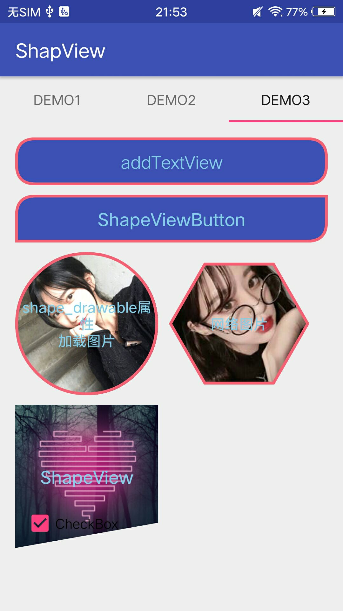

ShapeView
=========

可为你的View剪裁不同形状

[](http://www.apache.org/licenses/LICENSE-2.0.html)


APK文件
-------

扫描二维码 或者 点击二维码 下载

[](https://github.com/xwc520/ShapView/raw/master/image/app-release.apk)


Gradle
-------

```
compile 'com.github.xwc:ShapeView:1.2.8'
annotationProcessor 'com.github.xwc:ShapeView-compiler:1.2.5'

```
preview
-------




使用
----

- ShapeView
```xml
<com.github.xwc.view.ShapeView
     android:id="@+id/heartShapeView"
     android:layout_width="150dp"
     android:layout_height="150dp"
     app:shape_borderWidth="3dp"
     app:shape_heart_YPercent="0.16"
     app:shape_heart_radian="0.2"
     app:shape_defaultBgd="@mipmap/image1"
     app:shape_pressedBgd="@mipmap/image2"
     app:shape_type="heart">

     <!-- content -->

</com.github.xwc.view.ShapeView>
```
- ButtonShapeView

```
  <com.github.xwc.view.ButtonShapeView
        android:id="@+id/buttonShape"
        android:layout_width="match_parent"
        android:layout_height="50dp"
        android:layout_marginTop="5dp"
        app:shape_borderWidth="1dp"
        app:shape_defaultColor="#000000"
        app:shape_pressedColor="#FFFFFF"
        app:shape_roundRect_radius="30dp">

        <!-- content -->

  </com.github.xwc.view.ButtonShapeView>
```


公共属性
--------

属性名 | 说明 | 默认值
:----------- | :----------- | :-----------
shape_borderColor         | 边框颜色        | red
shape_borderDashGap         | 边框间隙        | 0
shape_borderWidth         | 边框宽度        | 0
shape_defaultBgd         | 背景图        |
shape_pressedBgd         | 按下时背景图        |
shape_defaultColor         | 背景色        |
shape_pressedColor         | 按下时背景        |


ButtonShapeView
---------------

属性名 | 说明 | 默认值
:----------- | :----------- | :-----------
shape_roundRect_radius         | 圆角         | 0
shape_roundRect_bottomLeftRadius         | 左边底部圆角        | 0
shape_roundRect_bottomRightRadius         | 右边底部圆角        | 0
shape_roundRect_topLeftRadius         | 左边上方圆角    | 0
shape_roundRect_topRightRadius         | 右边上分圆角         | 0

ShapeView
---------


**三角形**

属性名 | 说明 | 范围
:----------- | :----------- | :-----------
shape_triangle_percentLeft         | 左边顶点起始位置        | 0～1（float）
shape_triangle_percentBottom         | 下边顶点起始位置         | 0～1（float）
shape_triangle_percentRight         | 右边顶点起始位置         | 0～1（float）

**心形**

属性名 | 说明 | 范围
:----------- | :----------- | :-----------
shape_heart_radian         | 弧度        | 0～1（float）
shape_heart_YPercent         | 中间点位置         | 0～1（float）

**多边形**

属性名 | 说明 | 默认值
:----------- | :----------- | :-----------
shape_polygon_side         | 边数        | 4
shape_polygon_turn         | 中心点旋转角度         | 0 （0.5为90°）


**对角线**

属性名 | 说明 | 默认值
:----------- | :----------- | :-----------
shape_diagonal_direction         | 对角起点        | left
shape_diagonal_position         | 对角位置         | 0 （0.5为90°）

历史版本
--------

**v1.2.7** 更新业务逻辑

**v1.2.4** 修复圆角度数过大问题
    

**v1.2.2** 支持默认颜色和点击时Color,支持默认背景图和点击时背景图

**v1.2.1** 支持url加载图片

License
-------

Copyright 2018 xwc

   Licensed under the Apache License, Version 2.0 (the "License");
   you may not use this file except in compliance with the License.
   You may obtain a copy of the License at

       http://www.apache.org/licenses/LICENSE-2.0

   Unless required by applicable law or agreed to in writing, software
   distributed under the License is distributed on an "AS IS" BASIS,
   WITHOUT WARRANTIES OR CONDITIONS OF ANY KIND, either express or implied.
   See the License for the specific language governing permissions and
   limitations under the License.
