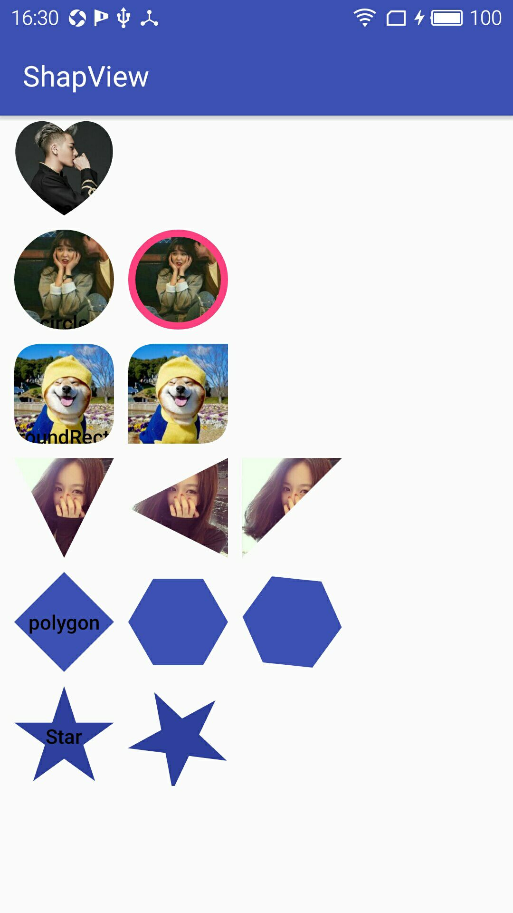

# ShapView
给任何一个View剪裁不同形状，即将推出更多形状敬请期待！！！

[](http://www.apache.org/licenses/LICENSE-2.0.html)

## preview


## Gradle


## Heart


```xml
<com.github.xwc.view.ShapeView
     android:id="@+id/heartShapeView"
     android:layout_width="100dp"
     android:layout_height="100dp"
     android:layout_marginLeft="10dp"
     app:shape_type="heart"
     android:layout_marginTop="10dp"
     app:layout_constraintLeft_toLeftOf="parent" >

      <ImageView
          android:layout_width="match_parent"
          android:layout_height="match_parent"
          android:scaleType="centerCrop"
          android:src="@mipmap/image4" />

      <TextView
          android:layout_width="wrap_content"
          android:layout_height="wrap_content"
          android:layout_gravity="center"
          android:layout_marginTop="30dp"
          android:text="heart"
          android:textColor="@android:color/black"
          android:textStyle="bold" />

 </com.github.xwc.view.ShapeView>
```

## Circle


```xml
<com.github.xwc.view.ShapeView
    android:id="@+id/circleShapeView"
    android:layout_width="100dp"
    android:layout_height="100dp"
    app:shape_circle_borderWidth="5dp"
    android:padding="5dp"
    app:shape_circle_borderColor="@color/colorAccent">

     <ImageView
         android:layout_width="match_parent"
         android:layout_height="match_parent"
         android:scaleType="centerCrop"
         android:src="@mipmap/image1" />

</com.github.xwc.view.ShapeView>
```

## RoundRect


```xml
<com.github.xwc.view.ShapeView
    android:id="@+id/roundRectShapeView"
    android:layout_width="100dp"
    android:layout_height="100dp"
    app:shape_roundRect_radius="20dp"
    app:shape_type="roundRect">

</com.github.xwc.view.ShapeView>
```

## Triangle


```xml
<com.github.xwc.view.ShapeView
    android:id="@+id/triangleShapeView"
    android:layout_width="100dp"
    android:layout_height="100dp"
    app:shape_triangle_percentBottom="0.5"
    app:shape_triangle_percentLeft="0"
    app:shape_triangle_percentRight="0"
    app:shape_type="triangle">
   
</com.github.xwc.view.ShapeView>
```

## Code
```java
    super.setClipHelper(new ClipHelper() {
            @Override
            public Path createClipPath(int width, int height) {
                final Path path = new Path();
                switch (shapeType) {
                    case 0: //circle
                        //xy为圆的圆心 radius为圆的半径 Diection.CW 顺时针方向
                        path.addCircle(width / 2f, height / 2f, Math.min(width / 2f, height / 2f), Path.Direction.CW);
                        break;
                    case 1://roundRect
                        RectF rectF = new RectF();
                        rectF.set(0, 0, width, height);
                        if (radius > 0) {
                            path.set(generatePath(rectF, radius, radius, radius, radius));
                        } else {
                            path.set(generatePath(rectF, topLeftRadius, topRightRadius, bottomRightRadius, bottomLeftRadius));
                        }
                        break;
                    case 2://triangle
                        path.moveTo(0, percentLeft * height);
                        path.lineTo(percentBottom * width, height);
                        path.lineTo(width, percentRight * height);
                        path.close();
                        break;
                    case 3://heart
                        path.moveTo(0.5f * width, 0.16f * height);
                        path.cubicTo(0.15f * width, -radian * height, -0.4f * width, 0.45f * height, 0.5f * width, height);
                        path.moveTo(0.5f * width, height);
                        path.cubicTo(width + 0.4f * width, 0.45f * height, width - 0.15f * width, -radian * height, 0.5f * width, 0.16f * height);
                        path.close();
                        break;
                }
                return path;
            }
        });
```

## <a href="http://mail.qq.com/cgi-bin/qm_share?t=qm_mailme&email=947017886@qq.com" >联系邮箱</a>


