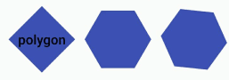

# ShapView
给任何一个View剪裁不同形状（现已有心形，圆形，圆角矩形，三角形，正多边形），即将推出更多形状敬请期待！！！

[](http://www.apache.org/licenses/LICENSE-2.0.html)


 ## APK文件

扫描二维码 或者 点击二维码 下载

[](https://github.com/xwc520/ShapView/raw/master/image/app-release.apk)


## Gradle
```
compile 'com.xwc:ShapeView:1.0.0'
```
## preview


## Heart


```xml
<com.github.xwc.view.ShapeView
     android:id="@+id/heartShapeView"
     android:layout_width="100dp"
     android:layout_height="100dp"
     android:layout_marginLeft="10dp"
     app:shape_type="heart"
     android:layout_marginTop="10dp"
     app:layout_constraintLeft_toLeftOf="parent" >

      <ImageView
          android:layout_width="match_parent"
          android:layout_height="match_parent"
          android:scaleType="centerCrop"
          android:src="@mipmap/image4" />

      <TextView
          android:layout_width="wrap_content"
          android:layout_height="wrap_content"
          android:layout_gravity="center"
          android:layout_marginTop="30dp"
          android:text="heart"
          android:textColor="@android:color/black"
          android:textStyle="bold" />

 </com.github.xwc.view.ShapeView>
```

## Circle


```xml
<com.github.xwc.view.ShapeView
    android:id="@+id/circleShapeView"
    android:layout_width="100dp"
    android:layout_height="100dp"
    app:shape_circle_borderWidth="5dp"
    android:padding="5dp"
    app:shape_circle_borderColor="@color/colorAccent">

     <ImageView
         android:layout_width="match_parent"
         android:layout_height="match_parent"
         android:scaleType="centerCrop"
         android:src="@mipmap/image1" />

</com.github.xwc.view.ShapeView>
```

## RoundRect


```xml
<com.github.xwc.view.ShapeView
    android:id="@+id/roundRectShapeView"
    android:layout_width="100dp"
    android:layout_height="100dp"
    app:shape_roundRect_radius="20dp"
    app:shape_type="roundRect">

</com.github.xwc.view.ShapeView>
```

## Triangle


```xml
<com.github.xwc.view.ShapeView
    android:id="@+id/triangleShapeView"
    android:layout_width="100dp"
    android:layout_height="100dp"
    app:shape_triangle_percentBottom="0.5"
    app:shape_triangle_percentLeft="0"
    app:shape_triangle_percentRight="0"
    app:shape_type="triangle">
   
</com.github.xwc.view.ShapeView>
```

## EquilateralPolygon


```xml
<com.github.xwc.view.ShapeView
  android:layout_width="70dp"
  android:layout_height="70dp"
  app:shape_polygon_side="6"
  app:shape_polygon_turn="0.3"
  app:shape_type="polygon">

  <ImageView
      android:layout_width="match_parent"
      android:layout_height="match_parent"
      android:background="@color/colorPrimary" />

</com.github.xwc.view.ShapeView>
```

## Star


```xml
<com.github.xwc.view.ShapeView
  android:layout_width="70dp"
  android:layout_height="70dp"
  app:shape_polygon_side="6"
  app:shape_polygon_turn="0.5"
  app:shape_type="star">

  <ImageView
      android:layout_width="match_parent"
      android:layout_height="match_parent"
      android:background="@color/colorPrimary" />

</com.github.xwc.view.ShapeView>
```


## Code
```java
      private void getCirclePath(Path path,int width,int height){
        //xy为圆的圆心 radius为圆的半径 Diection.CW 顺时针方向
        path.addCircle(width / 2f, height / 2f, Math.min(width / 2f, height / 2f), Path.Direction.CW);
    }

    private void getRoundRectPath(RectF rect, Path path, float topLeftDiameter, float topRightDiameter, float bottomRightDiameter, float bottomLeftDiameter) {
        topLeftDiameter = topLeftDiameter < 0 ? 0 : topLeftDiameter;
        topRightDiameter = topRightDiameter < 0 ? 0 : topRightDiameter;
        bottomLeftDiameter = bottomLeftDiameter < 0 ? 0 : bottomLeftDiameter;
        bottomRightDiameter = bottomRightDiameter < 0 ? 0 : bottomRightDiameter;

        path.moveTo(rect.left + topLeftDiameter, rect.top);

        path.lineTo(rect.right - topRightDiameter, rect.top);
        path.quadTo(rect.right, rect.top, rect.right, rect.top + topRightDiameter);
        path.lineTo(rect.right, rect.bottom - bottomRightDiameter);
        path.quadTo(rect.right, rect.bottom, rect.right - bottomRightDiameter, rect.bottom);
        path.lineTo(rect.left + bottomLeftDiameter, rect.bottom);
        path.quadTo(rect.left, rect.bottom, rect.left, rect.bottom - bottomLeftDiameter);
        path.lineTo(rect.left, rect.top + topLeftDiameter);
        path.quadTo(rect.left, rect.top, rect.left + topLeftDiameter, rect.top);
        path.close();
    }

    private void getTrianglePath(Path path, int width, int height) {
        path.moveTo(0, percentLeft * height);
        path.lineTo(percentBottom * width, height);
        path.lineTo(width, percentRight * height);
        path.close();
    }

    private void getHeartPath(Path path, int width, int height) {
        path.moveTo(0.5f * width, 0.16f * height);
        path.cubicTo(0.15f * width, -radian * height, -0.4f * width, 0.45f * height, 0.5f * width, height);
        path.moveTo(0.5f * width, height);
        path.cubicTo(width + 0.4f * width, 0.45f * height, width - 0.15f * width, -radian * height, 0.5f * width, 0.16f * height);
        path.close();
    }

    private void getPolygonPath(RectF rect, Path path) {
        if (sides < 3) {
            return;
        }
        float r = (rect.right - rect.left) / 2;
        float mX = (rect.right + rect.left) / 2;
        float my = (rect.top + rect.bottom) / 2;
        for (int i = 0; i <= sides; i++) {
            // - 0.5 : Turn 90 °
            float alpha = Double.valueOf(((2f / sides) * i - turn) * Math.PI).floatValue();
            float nextX = mX + Double.valueOf(r * Math.cos(alpha)).floatValue();
            float nextY = my + Double.valueOf(r * Math.sin(alpha)).floatValue();
            if (i == 0) {
                path.moveTo(nextX, nextY);
            } else {
                path.lineTo(nextX, nextY);
            }
        }

    }
```


### <a href="http://mail.qq.com/cgi-bin/qm_share?t=qm_mailme&email=947017886@qq.com" >联系邮箱</a>

## LICENSE
```
Copyright 2018 xwc

   Licensed under the Apache License, Version 2.0 (the "License");
   you may not use this file except in compliance with the License.
   You may obtain a copy of the License at

       http://www.apache.org/licenses/LICENSE-2.0

   Unless required by applicable law or agreed to in writing, software
   distributed under the License is distributed on an "AS IS" BASIS,
   WITHOUT WARRANTIES OR CONDITIONS OF ANY KIND, either express or implied.
   See the License for the specific language governing permissions and
   limitations under the License.
```


