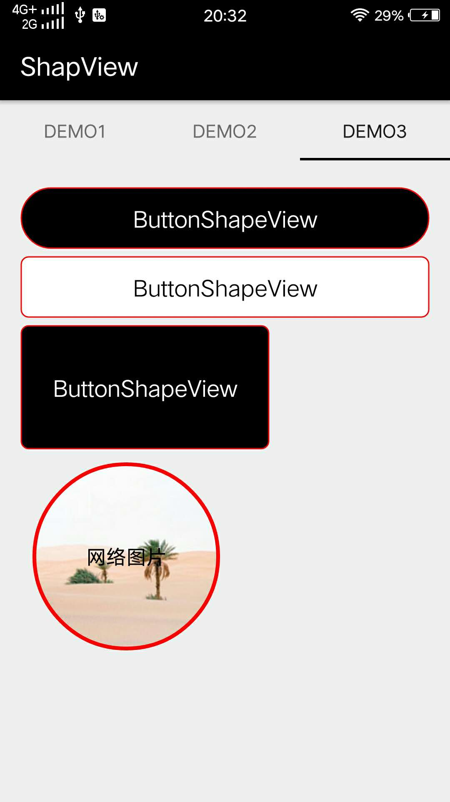

# ShapView
给任何一个View剪裁不同形状，并且代替shape

[](http://www.apache.org/licenses/LICENSE-2.0.html)


 ## APK文件

扫描二维码 或者 点击二维码 下载

[](https://github.com/xwc520/ShapView/raw/master/image/app-release.apk)
#### v1.2.4 
    1.修复圆角度数过大问题

#### v1.2.3 
    1.优化修复

#### v1.2.2 
    1.可展示默认颜色和点击时颜色
    2.可展示默认图片和点击时图片

#### v1.2.1 
    1.新增shape_drawble属性
    2.url方式加载图片 
    
 

## Gradle
```
compile 'com.github.xwc:ShapeView:1.2.4'
```
## preview



## example


```xml
<com.github.xwc.view.ShapeView
     android:id="@+id/heartShapeView"
     android:layout_width="150dp"
     android:layout_height="150dp"
     app:shape_borderWidth="3dp"
     app:shape_heart_YPercent="0.16"
     app:shape_heart_radian="0.2"
     app:shape_default_drawable="@mipmap/image1"
     app:shape_pressed_drawable="@mipmap/image2"
     app:shape_type="heart">

    <TextView
        android:layout_width="wrap_content"
        android:layout_height="wrap_content"
        android:layout_gravity="center"
        android:text="ShapeView"
        android:textColor="#87CEEB"
        android:textSize="18sp"
        android:textStyle="bold" />

</com.github.xwc.view.ShapeView>
```


## attrs 属性
```
      <declare-styleable name="ShapeView">
          <!--边框颜色-->
          <attr name="shape_borderColor" format="color" />
          <!--边框宽度-->
          <attr name="shape_borderWidth" format="dimension" />
          <!--虚线间隙-->
          <attr name="shape_borderDashGap" format="dimension" />
          <!--虚线宽度-->
          <attr name="shape_borderDashWidth" format="dimension" />
          <!-- 默认背景图-->
          <attr name="shape_default_drawable" format="reference" />
          <!--点击时背景图-->
          <attr name="shape_pressed_drawable" format="reference" />
          <!--点击时背景色-->
          <attr name="shape_pressed_color" format="color" />
          <!--默认背景色-->
          <attr name="shape_default_color" format="color" />


          <!--形状类型-->
          <attr name="shape_type" format="enum">
              <!--圆形-->
              <enum name="circle" value="0" />
              <!--圆角矩形-->
              <enum name="roundRect" value="1" />
              <!--三角形-->
              <enum name="triangle" value="2" />
              <!--心形-->
              <enum name="heart" value="3" />
              <!--正多边形-->
              <enum name="polygon" value="4" />
              <!--五角星-->
              <enum name="star" value="5" />
              <!--对角线-->
              <enum name="diagonal" value="6" />
          </attr>

          <!--圆角矩形的四边弧度可分别配置或者直接使用shape_roundRect_radius同时配置-->
          <attr name="shape_roundRect_bottomLeftRadius" format="dimension" />
          <attr name="shape_roundRect_bottomRightRadius" format="dimension" />
          <attr name="shape_roundRect_topLeftRadius" format="dimension" />
          <attr name="shape_roundRect_topRightRadius" format="dimension" />
          <attr name="shape_roundRect_radius" format="dimension" />

          <!--三角形三个顶点的起始位置 0～1 float类型-->
          <attr name="shape_triangle_percentLeft" format="float" />
          <attr name="shape_triangle_percentBottom" format="float" />
          <attr name="shape_triangle_percentRight" format="float" />


          <!--心形弧度-->
          <attr name="shape_heart_radian" format="float" />
          <!--心形上面连接点位置 0～1 float类型-->
          <attr name="shape_heart_YPercent" format="float" />

          <!--多边形形边数-->
          <attr name="shape_polygon_side" format="integer" />
          <!--多边形按照XY中心点旋转  0.5为90°-->
          <attr name="shape_polygon_turn" format="float" />


          <!--对角线对角的起点 -->
          <attr name="shape_diagonal_direction" format="enum">
              <enum name="left" value="1" />
              <enum name="right" value="2" />
          </attr>
          <!--对角线对角在哪个位置-->
          <attr name="shape_diagonal_position" format="enum">
              <enum name="bottom" value="1" />
              <enum name="top" value="2" />
              <enum name="left" value="3" />
              <enum name="right" value="4" />
          </attr>
          <attr name="shape_diagonal_angle" format="integer" />

      </declare-styleable>
```


### <a href="http://mail.qq.com/cgi-bin/qm_share?t=qm_mailme&email=947017886@qq.com" >联系邮箱</a>

## LICENSE
```
Copyright 2018 xwc

   Licensed under the Apache License, Version 2.0 (the "License");
   you may not use this file except in compliance with the License.
   You may obtain a copy of the License at

       http://www.apache.org/licenses/LICENSE-2.0

   Unless required by applicable law or agreed to in writing, software
   distributed under the License is distributed on an "AS IS" BASIS,
   WITHOUT WARRANTIES OR CONDITIONS OF ANY KIND, either express or implied.
   See the License for the specific language governing permissions and
   limitations under the License.
```


